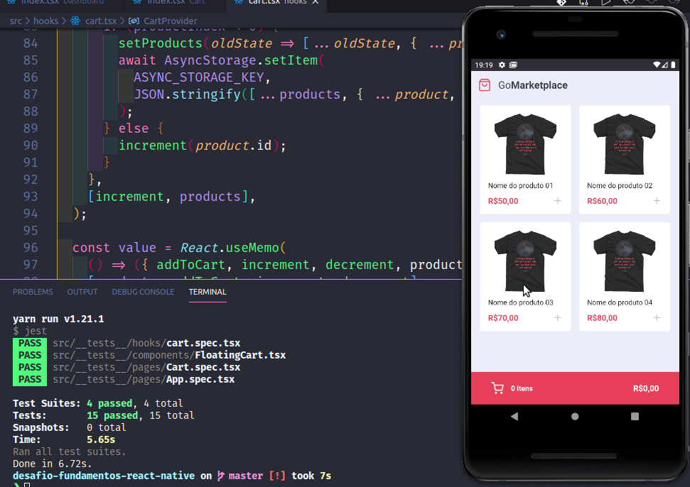

# :rocket: Sobre o desafio

Nesse desafio, foi desenvolvido uma aplicação chamada **GoMarketplace**. O intuito é praticar os conceitos de React Native, junto com TypeScript, utilizando rotas, Async Storage e a Context API.



## Utilizando uma fake API

Para obter os dados e exibí-los em tela, há um arquivo que pode ser usado como uma fake API.

Para isso, tem uma dependência chamada `json-server`, e um arquivo chamado `server.json` que contém os dados para uma rota `/products`. Para executar esse servidor você pode executar o seguinte comando:

```js
  yarn json-server server.json -p 3333
```

## Funcionalidades da aplicação

Para verificar o código que foi desenvolvido para esse desafio, abra os arquivos da pasta `src`.

- **`Listar os produtos da fake API`**: A página `Dashboard` deve ser capaz de exibir uma listagem através de uma tabela, com o campo `title`, `image_url` e `price`.

- **`Adicionar itens ao carrinho`**: Em toda a aplicação, foi usado o Contexto `hooks/cart.tsx` para adicionar itens ao carrinho.

**Dica**: Produto que já foi adicionando no carrinho, altera-se apenas a quantidade dele no seu contexto para evitar itens duplicados.

- **`Exibir itens do carrinho`**: Na página `Cart` é exibido todos os itens do carrinho, junto com a quantidade, valor único, valor subtotal dos itens e total de todos os items.

- **`Aumentar quantidade de itens do carrinho`**: Na página `Cart` o usuário pode aumentar a quantidade de itens do mesmo produto, usando a função `increment` dentro do contexto em `/src/hooks/cart.tsx`.

- **`Diminuir quantidade de um item do carrinho`**: Na página `Cart` o usuário pode decrementar a quantidade de itens do mesmo produto, usando a função `decrement` dentro do contexto em `/src/hooks/cart.tsx`.

- **`Exibir valor total dos itens no carrinho`**: Tanto na página `Dashboard`, tanto na página `Cart` deve exibir o valor total de todos os itens que estão no seu carrinho.

## Específicação dos testes

Em cada teste, tem uma breve descrição do que a aplicação deve cumprir para que o teste passe.

Para esse desafio, temos os seguintes testes:

- **`should be able to list the products`**: Para que esse teste passe, a aplicação deve permitir que sejam listados na sua tela `Dashboard`, toda os produtos que são retornadas do Fake API. Essa listagem deve exibir o `title` e o `price` que deve ser formatado utilizando a função `Intl`.

- **`should be able to add a product to the cart`**: Para que esse teste passe, deve ser possível adicionar produtos da sua `Dashboard` ao carrinho, utilizando o contexto de `cart`.

- **`should be able to list the products on the cart`**: Para que esse teste passe, deve ser possível listar os produtos que estão salvos no contexto do seu carrinho na página `Cart`, nessa página exiba o nome do produto, o subtotal total de cada produto (price \* quantity).

- **`should be able to calculate the cart total`**: Para que esse teste passe, tanto na página `Dashboard`, tanto na página `Cart` deve exibir o valor total de todos os itens que estão no seu carrinho.

- **`should be able to show the total quantity of itens in the cart`**: Para que esse teste passe, tanto na página `Dashboard`, tanto na página `Cart` deve exibir o número total de itens que estão no seu carrinho.

- **`should be able to increment product quantity on the cart`**: Para que esse teste passe, deve ser possível incrementar a quantidade de um produto do seu carrinho, utilizando o contexto de `cart` disponibilizado.

- **`should be able to decrement product quantity on the cart`**: Para que esse teste passe, deve ser possível decrementar a quantidade de um produto do seu carrinho, utilizando o contexto de `cart` disponibilizado.

**Dica**: Ao decrementar a quantidade de um produto, não permita que ele seja decrementado para um valor negativo, sendo a quantidade mínima 1 para estar no carrinho.

- **`should be able to navigate to the cart`**: Para que esse teste passe, no componente `FloatingCart` na Dashboard, deve permitir que ao clicar no botão de carrinho com o testID de `navigate-to-cart-button`, o usuário seja redirecionado para a página `Cart`.

- **`should be able to add products to the cart`**: Para que esse teste passe, no arquivo onde contém o contexto do carrinho, deve permitir que a função `addToCart` adicione um novo item ao carrinho.

- **`should be able to increment quantity`**: Para que esse teste passe, no arquivo onde contém o contexto do carrinho, deve permitir que a função `increment` acrescente `1` unidade a quantidade de um item que está armazenado no contexto.

- **`should be able to decrement quantity`**: Para que esse teste passe, no arquivo onde contém o contexto do carrinho, deve permitir que a função `decrement` subtraia `1` unidade a quantidade de um item que está armazenado no contexto.

- **`should store products in AsyncStorage while adding, incrementing and decrementing`**: Para que esse teste passe, no arquivo onde contém o contexto do carrinho deve permitir que todas as atualizações que fizer no carrinho, sejam salvar no AsyncStorage. Por exemplo, ao adicionar um item ao carrinho, adicione-o também no AsyncStorage. Lembre de também atualizar o valor do AsyncStorage quando você incrementar ou decrementar a quantidade de um item.

- **`should load products from AsyncStorage`**: Para que esse teste passe, no arquivo onde contém o contexto do carrinho, deve permitir que todos os produtos que foram adicionados sejam buscados do AsyncStorage.

## :calendar: Entrega

Esse desafio foi entregue pela plataforma Skylab da Rocketseat.

---

Made with ♥ by Márcio França Lima. [Contact me](https://www.linkedin.com/in/m%C3%A1rcio-fran%C3%A7a-lima-916454187/)
